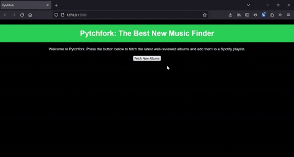

## Pytchfork: Best New music

A simple program to scrape the 'best new albums' from Pitchfork and then use the Spotify API to make a playlist of the albums.


## Description

This program scrapes the 'Best New Music' section from Pitchfork and adds them to a .csv file. It then uses the Spotify API to search for the albums on Spotify and adds them to a specified playlist.

The project also includes a basic web interface.

## Getting Started

### Dependencies

* This project uses Python 3.7+. Make sure you have it installed on your system.
* Install all the dependencies listed in the `requirements.txt` file. 

### Installing and Executing

1. Clone this repository to your local machine.
2. Install the dependencies:
    ```
    pip install -r requirements.txt
    ```
3. Run the Flask app:
    ```
    python app.py
    ```

and then it lives...




